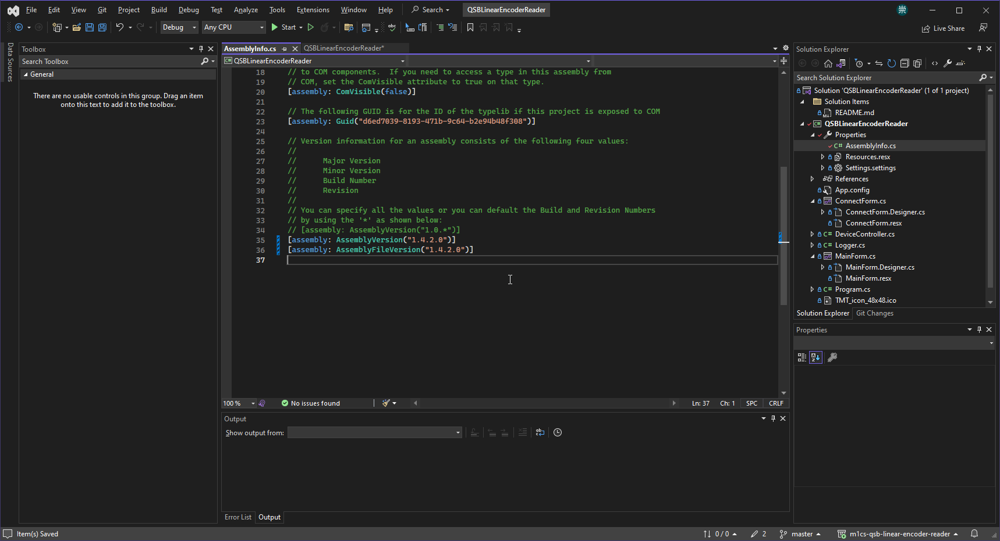
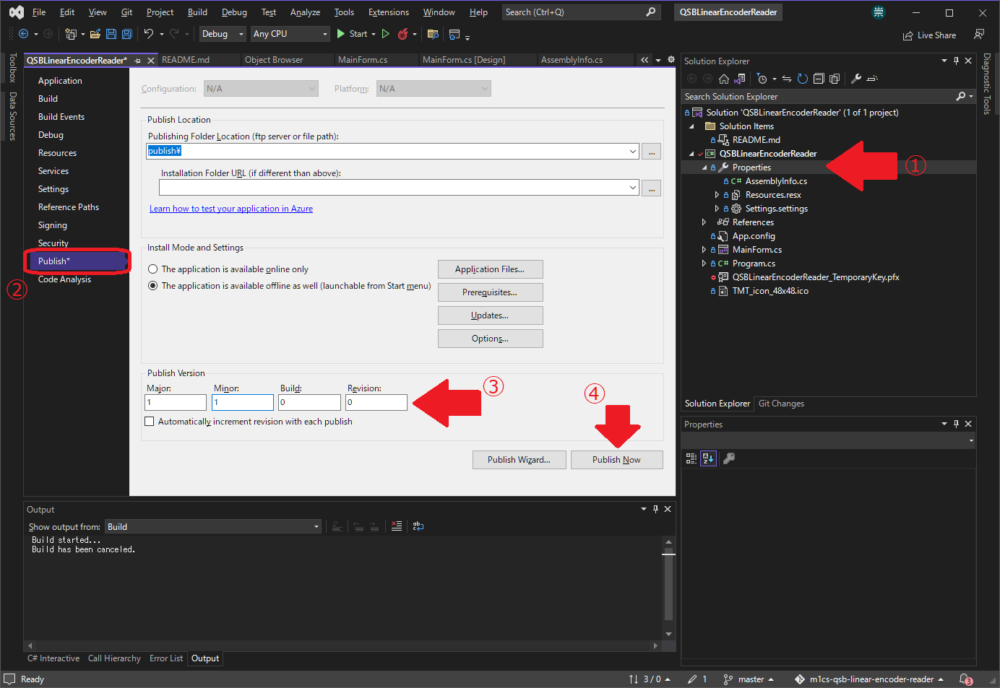
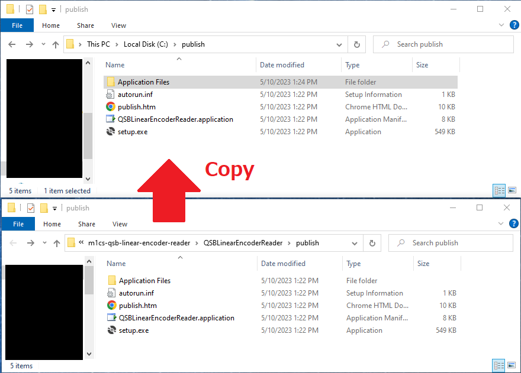
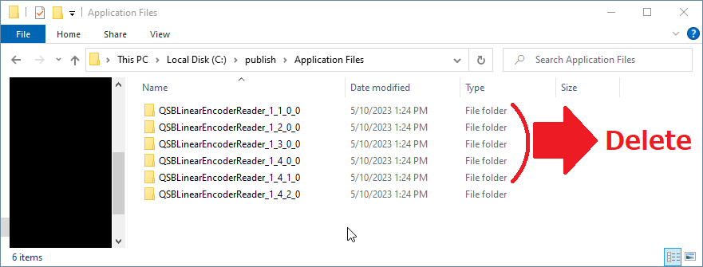
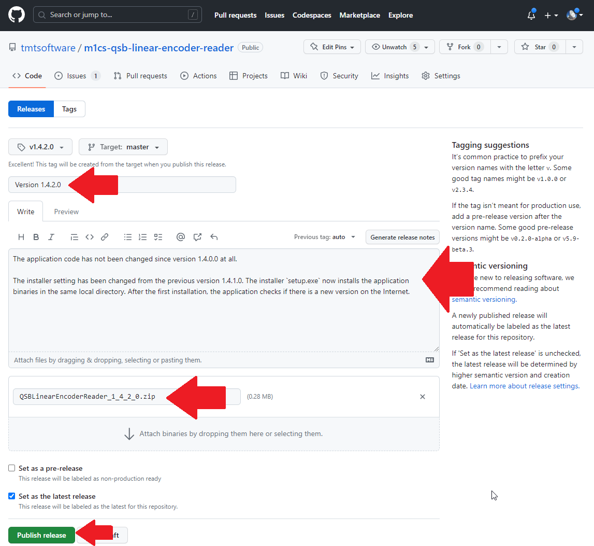

# Developer information

This page includes information for software developers who want to modify the code and release new versions.

## Development environment

The programming language of this software is C#. It is hightly recommended to use
Visual Studio 2022 (or newer) for software development. Instructions below assume
that you have Visual Studio installed in your computer.

## Open the latest source code with Visual Studio

If you already have Visual Studio installed in your computer, you can check out and open
the latest source code from this GitHub page. Before doing so, make sure that you are logged
in GitHub with your account. Then, click "Code" in the top right corner of this page and
select "Open with Visual Studio". Then, Visual Studio will automatically launch, check out
this git repository and open the latest source code in it.

## Release procedure

When you release a new version, follow the steps below:

### 1. Change assembly version number

Double-click and open [AssemblyInfo.cs](QSBLinearEncoderReader/Properties/AssemblyInfo.cs) under `Properties` in the Solution Exprlorer.
Change the version number in `AssemblyVersion` and `AssemblyFileVersion` at the bottom.

### 2. Generate installer

Double-click and open `Properties` in the Solution Explorer, and select `Publish` in the left panel of the Properties pane.
Then, change the publish version to match what you set in [AssemblyInfo.cs](QSBLinearEncoderReader/Properties/AssemblyInfo.cs).
After that, press `Publish Now` button to generate an installer.

### 3. Zip the installer

The installer is generated under `publish` folder in the project folder ([QSBlinearEncoderReader/](QSBLinearEncoderReader/)).
Copy all files and directories under the `publish` directory to somewhere else. From here on, we assume that they are copied to `C:\publish`.

You should be able to see directories of old versions in `C:\publish\Application Files` like `QSBLinearEncoderReader_1_1_0_0`. Remove all directories of old versions and leave the latest version only.
For example, if you are going to release version w.x.y.z, remove all directories except `C:\publish\Application Files\QSBLinearEncoderReader_w_x_y_z`.

Then, zip all files in `C:\publish`. Make sure that `setup.exe` and `QSBLinearEncoderReader.application` are included.
Finally, change the zip file name to `QSBLinearEncoderReader_w.x.y.z.zip` where `w.x.y.z` is the version number.

### 4. Commit and push code to GitHub

At this point, commit all your local changes in your local git repository. Please make sure that your commit includes all changes and new files under the `publish` directory.
Typically, [QSBLinearEncoderReader\publish\QSBLinearEncoderReader.application](https://github.com/tmtsoftware/m1cs-qsb-linear-encoder-reader/blob/master/QSBLinearEncoderReader/publish/QSBLinearEncoderReader.application) is updated and a new directory [publish\Application Files\QSBLinearEncoderReader_w_x_y_z](https://github.com/tmtsoftware/m1cs-qsb-linear-encoder-reader/tree/master/QSBLinearEncoderReader/publish/Application%20Files) is added.
The commit message should indicate that it is the new release version like "Version w.x.y.z".
Then, push your local changes to the `master` branch on https://github.com/tmtsoftware/m1cs-qsb-linear-encoder-reader.git.
It is recommended to confirm that your last commit appears in https://github.com/tmtsoftware/m1cs-qsb-linear-encoder-reader.git before going to the next step.

Note: Contents under the [QSBLinearEncoderReader\publish](https://github.com/tmtsoftware/m1cs-qsb-linear-encoder-reader/blob/master/QSBLinearEncoderReader/publish/) directory in the `master` branch are referenced by the automatic application updater through raw.githubusercontent.com (e.g. https://raw.githubusercontent.com/tmtsoftware/m1cs-qsb-linear-encoder-reader/master/QSBLinearEncoderReader/publish/QSBLinearEncoderReader.application). If you want to see this automatic application updater settings, double-click and open `Properties` in the Solution Explorer, select `Publish` in the left panel of the Properties pane and press `Updates...` button. You should be able to see `Application Updates` dialog as shown below.

### 5. Draft a new release

Go to [Releases](https://github.com/tmtsoftware/m1cs-qsb-linear-encoder-reader/releases) page of this repository, and click `Draft a new release`.

### 6. Create a release tag on Git

In the new release page, click `Choose a tag` and enter a new git tag name for this release.
The tag name must be `vw.x.y.z` where `w.x.y.z` is the version number. Don't forget `v` at the beginning.

### 7. Enter the release information

Enter the release title and the release description. The title should be "Version w.x.y.z" where `w.x.y.z` is the actual version number.
The release description should include the summary of changes from the previous version.

Then, drag and drop the zip file you created (i.e. `QSBLinearEncoderReader_w.x.y.z.zip`) to the bottom of the page and then press `Publish release` button.

### 8. Done!

Now your new released version must appear in https://github.com/tmtsoftware/m1cs-qsb-linear-encoder-reader.git.

Since version 1.4.1.0, every time the application launches, it investigates [QSBLinearEncoderReader/publish/QSBLinearEncoderReader.application in the `master` branch](https://raw.githubusercontent.com/tmtsoftware/m1cs-qsb-linear-encoder-reader/master/QSBLinearEncoderReader/publish/QSBLinearEncoderReader.application) and see if there is a new version. If so, the user is suggested to upgrade to a new version and new versions are downloaded and installed automatically.

## Application examples and comamnd list of QSB-D

Application examples and command list of QSB-D can be obtained at 
https://www.usdigital.com/products/accessories/interfaces/usb/qsb/

The copy of those files can be found in this repository for our records:
 * [docs/qsb-applications-examples.pdf](docs/qsb-applications-examples.pdf)
 * [docs/qsb-commands-list.pdf](docs/qsb-commands-list.pdf)
