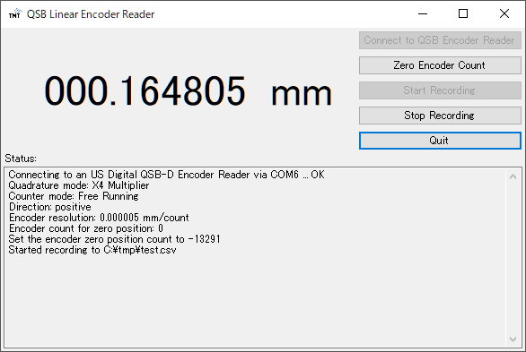

# QSB Linear Encoder Reader

This is a simple Windows application that reads an encoder count through [US Digital QSB-D](https://www.usdigital.com/products/accessories/interfaces/usb/qsb/) and show it in GUI.

## License

TBD

Note that this repository includes third party libraries USDigital.dll and USDQsB.dll in [Library](QSBLinearEncoderReader/Library) directory.
They were copied from [US Digital website](https://www.usdigital.com/support/resources/downloads/software/qsb-software/).

## TODO

 * Allow the user to select COM port.
 * Package the application.
 * Document how to import source code to Visual Studio.
