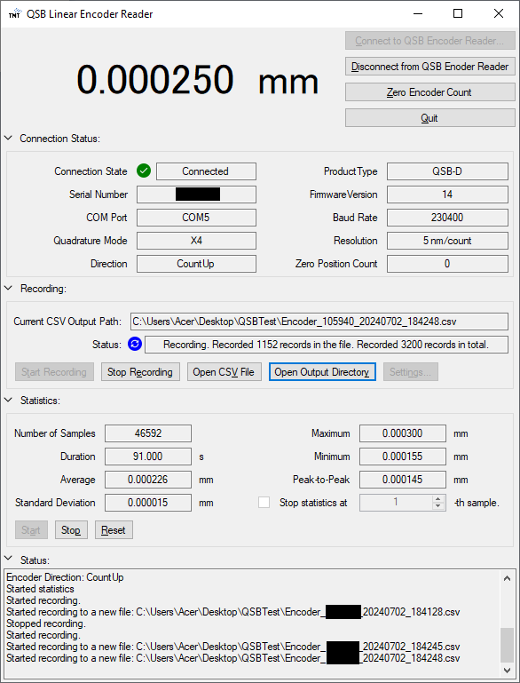
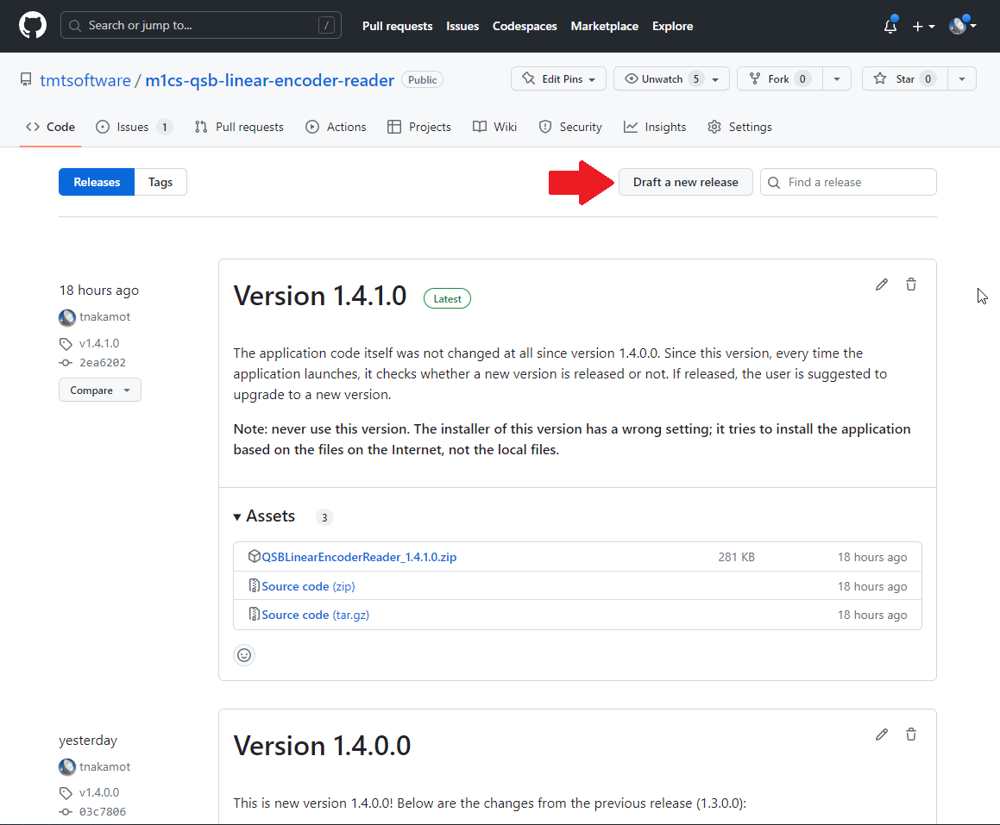
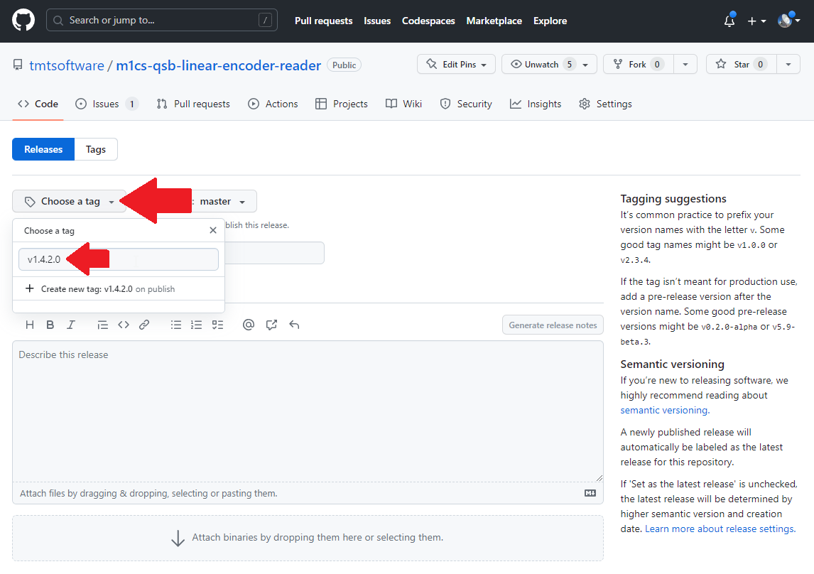

# QSB Linear Encoder Reader

This is a simple Windows application that reads an encoder count through [US Digital QSB-D](https://www.usdigital.com/products/accessories/interfaces/usb/qsb/) and shows it in GUI.

 

## Insallation

Go to the [Releases](https://github.com/tmtsoftware/m1cs-qsb-linear-encoder-reader/releases) page and download the zip file of the latest version.

Extract the zip file, run `setup.exe` in it and follow the instructions to complete the installation. 
You may be asked about the security, but you should ignore them.

When the installation process is copmlete, the application automatically launches.
If you want to launc it again, select `TMT International Observatory` - `QSB Linear Encoder Reader` in the Windows menu.

## Usage

### Prerequisite

Before launching this application, connect your [QSB-D](https://www.usdigital.com/products/accessories/interfaces/usb/qsb/) to an USB port of your computer.
Then, check the port name of the QSB-D with [US Digital Device Explorer](https://www.usdigital.com/support/resources/downloads/software/qsb-software/).
Typically, it is "COMx" where "x" is an integer number (e.g. COM4).

Please make sure that the baud rate setting of your QSB-D is the same as the factory default (230400 bits/sec).
If you have ever changed the baud rate from the factory default, revert the setting using [US Digital Device Explorer](https://www.usdigital.com/support/resources/downloads/software/qsb-software/).

### Application usage

Once the main application window is shown, click `Connect to QSB Encoder Reader`.

In the "Connect to QSB Encoder Reader" dialog, select an appropriate port name in `COM Port:`, set other configuration items accordingly, and press the `Connect` button.

If connection to your QSB-D is successful, the application starts to continuously read the current position from the encoder and show it in the main window.

Press `Zero Encoder Count` button to set the current position as zero.

Press `Start Recording` button to save the encoder readings in a CSV file. It will ask you which CSV file to save. You can stop recording by pressing `Stop recording` button.

## License

The license of this software is TBD.

Note that this repository includes third party libraries USDigital.dll and USDQsB.dll in [Library](QSBLinearEncoderReader/Library) directory.
They were copied from [US Digital website](https://www.usdigital.com/support/resources/downloads/software/qsb-software/).

## Developer information

This chapter includes information for software developers who may modify the code and release new versions.

### Development environment

The programing language of this software is C#. It is hightly recommended to use
Visual Studio 2022 (or newer) for software development. Instructions below assume
that you have Visual Studio installed in your computer.

### Open the latest source code with Visual Studio

If you already have Visual Studio installed in your computer, you can check out and open
the latest source code by clicking "Code" in the top right corner of this page and selecting
"Open with Visual Studio".

### Release procedure

When you release a new version, follow the steps below:

#### 1. Change assembly version number

Double-click and open [AssemblyInfo.cs](QSBLinearEncoderReader/Properties/AssemblyInfo.cs) under `Properties` in the Solution Exprlorer.
Change the version number in `AssemblyVersion` and `AssemblyFileVersion` at the bottom.

### 2. Generate installer

Double-click and open Properties in the Solution Explorer, and select `Publish` in the left panel of the Properties pane.
Then, change the publich version to match what you set in [AssemblyInfo.cs](QSBLinearEncoderReader/Properties/AssemblyInfo.cs).
After that, press `Publish Now` button to generate an installer.

### 3. Zip the installer

The installer is generated under `publish` folder in the project folder ([QSBlinearEncoderReader/](QSBLinearEncoderReader/)).
Zip all flies there and change the zip file name to `QSBLinearEncoderReader_w.x.y.z` where `w.x.y.z` is the version number.

### 4. Commit and push code to GitHub

At this point, commit all your local changes. The commit message should indicate that it is the new release version like "Version w.x.y.z".
Thenn, push your local changes to `master` branch on https://github.com/tmtsoftware/m1cs-qsb-linear-encoder-reader.git.
It is recommended to confirm that your last commit appears in https://github.com/tmtsoftware/m1cs-qsb-linear-encoder-reader.git before going to the next step.

### 5. Draft a new release

Go to [Releases](https://github.com/tmtsoftware/m1cs-qsb-linear-encoder-reader/releases) page of this repository, and click `Draft a new release`.

### 6. Create a release tag on Git

In the new release page, click `Choose a tag` and enter a new git tag name for this release.
The tag name must be `vw.x.y.z` where `w.x.y.z` is the version number. Don't forget `v` at the beginning.

### 7. Enter the release information

Enter the release title and the release description. The title should be "Version w.x.y.z" where `w.x.y.z` is the actual version number.
The release description should include the summary of changes from the previous version.

Then, drag and drop the zip file you created to the bottom of the page and then press `Publish release` button.

### 8. Done!

Now your new released version must appear in https://github.com/tmtsoftware/m1cs-qsb-linear-encoder-reader.git.

## TODO

 * Support the recording at the maximum rate (512 Hz)