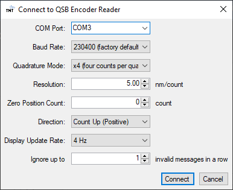

# QSB Linear Encoder Reader

This is a simple Windows application that reads an encoder count through [US Digital QSB-D](https://www.usdigital.com/products/accessories/interfaces/usb/qsb/) and shows it in GUI.

 

## Insallation

Go to our [Releases](https://github.com/tmtsoftware/m1cs-qsb-linear-encoder-reader/releases) page and download the zip file of the latest version named `QSBLinearEncoderReader_w_x_y_z.zip` where *w_x_y_z* is the version number (e.g. `QSBLinearEncoderReader_2_0_0_0.zip`).

Once you downloaded the zip file, right click it in the Explorer and select `Properties`. In the Properties dialog, open `General` tab and check if you can see "Unblock" checkbox in the bottom. If so, check the box and press `Apply` button. Now the checkbox should be gone. Once you confirm that the checkbox is not there, click `OK` button and extract this zip file as usual.

  
  
  

Once extracted, run `setup.exe` and follow the instructions to complete the installation.

If the installation is successful, the application launches automatically. Just close it at this moment.

*Note: this application uses [ClickOnce](https://learn.microsoft.com/en-us/visualstudio/deployment/clickonce-security-and-deployment) technology, so the application is installed per user and you do not need administrative permission.*

## Usage

### Prerequisite

Before launching this application, make sure that you connected [QSB-D](https://www.usdigital.com/products/accessories/interfaces/usb/qsb/) to an USB port of your computer.
Then, check the port name of the QSB-D with [US Digital Device Explorer](https://www.usdigital.com/support/resources/downloads/software/qsb-software/).
Typically, it is "COMx" where "x" is an integer number (e.g. COM4).

### Launch Application

Select `TMT International Observatory` - `QSB Linear Encoder Reader` in the Windows menu.

### Application usage

Once the main application window is shown, click `Connect to QSB Encoder Reader`.

In the "Connect to QSB Encoder Reader" dialog, select an appropriate port name in `COM Port:`, set other configuration items accordingly and press the `Connect` button.

If it is connected to your QSB-D successfully, it starts to continuously read the current position from the encoder and display it in the main window as shown below:

Press `Zero Encoder Count` button to set the current position as zero.

You can stop statistics by pressing `Stop` button.

## Recording to a CSV file

If you want to store the encoder readings in a CSV file, click `Settings...` first. A dialog shows up and you can configure the output directory, output file name, maximum records per one CSV file and recording interval (sampling rate for recording).

Click `OK` to close the dialog and click `Start Recording` to start the recording to CSV files. Once the number of records in one file reaches the configured limit, the following data is written to a new file. The file name is determined based on the configuration. If the file already exists, the recording stops. For a long running test, it is highly recommended to have date and time (%Y%m%d_%H%M%S) in the file name. If you are monitoring two or more encoders in one machine, it is also recommended to include the serial number of QSB-D (%N) in the file name. %Y, %m, %d, %H, %M, %S and %N are automatically substituted by appropriate values by this application.

The CSV file has three fields "Timestamp [s]", "Raw Count" and "Position [mm]".

The QSB-D samples the encoder value at 512 Hz and this application reads all the samples. The user can select recording interval as a multiple of 0.001953125 seconds (= 1/512).
One record in the CSV file is typically 30 - 50 bytes. If the recording interval is 1 (= 0.01953125 seconds, 512 Hz), the CSV file grows at a rate of 15 - 25 kB/s or 0.9 - 1.5 MB/minute.
If the recording interval is 512 (1 second, 1 Hz), the CSV file grows at a rate of 100 - 175 kB/hour or 2.5 - 4.1 MB/day.

Note that the timestamp is based on the 32-bit timestamp register in the QSB-D, which is incremented at 512 Hz. The timestamp register is reset when the power to QSB-D is turned off.
If you keep running QSB-D more than 94.5 days, the timestamp register may be reset to 0.
The timestamp register is most probably based on a free running counter in the QSB-D and it is not synchronized to UTC. When you want to correlate the recorded data in the CSV files with something else, please keep in mind that it can be slightly less or more than 512 Hz.

## Upgrading

Since [version 1.4.1.0](https://github.com/tmtsoftware/m1cs-qsb-linear-encoder-reader/releases/tag/v1.4.1.0), the application automatically checks if a new version is available every time it launches. If "Update Available" dialog is shown as below, it means that a new version is available. Just click `OK` to install the latest version.

After the latest version is successfully installed and launched, you may encounter a blue dialog titled "Windows protected your PC". Click "More info" link in the dialog and run "Run anyway" button. 

  
  

  
*Note: if you are using version 1.4.0.0 or older, the automatic version check feature is not available. If you want to upgrade to a newer version, you first need to [uninstall](#uninstall) the old version and install a new one.*

*Note: if you want to downgrade to an old version, the recommended approach is to [uninstall](#uninstall) the existing version and install the old version.*

## Uninstall

If you want to uninstall this application, open Control Panel and select `Uninstall a program`. Then, a list of installed applications is shown. Find "QSB Linear Encoder Reader", right-click it, select "Uninstall/Change" and follow dialog instructions to complete the uninstallation.

## License

TMT International Observatory holds the copyright of software, images and documents in this repository except the files below:

 * the following documents distributed by US Digital:
    * [docs/qsb-applications-examples.pdf](docs/qsb-applications-examples.pdf)
    * [docs/qsb-commands-list.pdf](docs/qsb-commands-list.pdf)
 * all image files under [icons/icnoir](icons/iconoir).
    * They were obtained from https://github.com/iconoir-icons/iconoir.
    * They are distributed under MIT license. See [LICENSE](icons/iconoir/LICENSE) for more information.

## Issues

File any bugs, enhancement proposals, feature requests on [Issues](https://github.com/tmtsoftware/m1cs-qsb-linear-encoder-reader/issues).

## Developer Information

The information for software developers who want to modify the code and release new versions can be found in [DEVELOPER.md](DEVELOPER.md).
