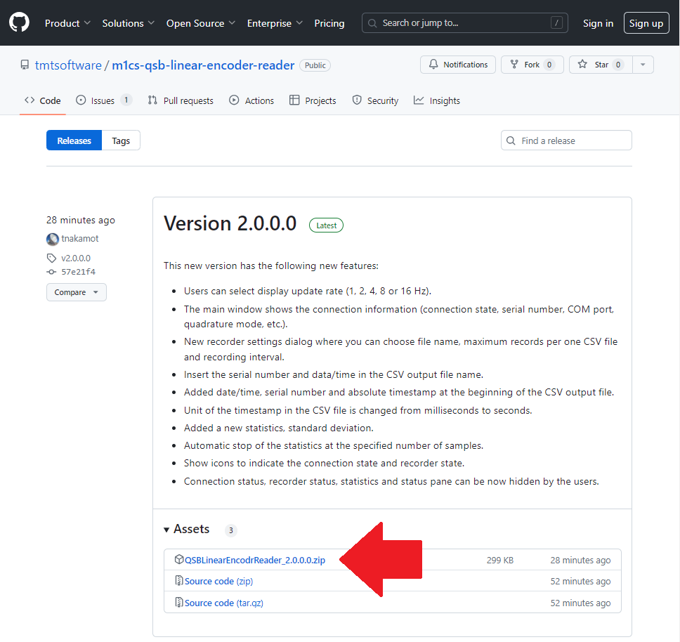
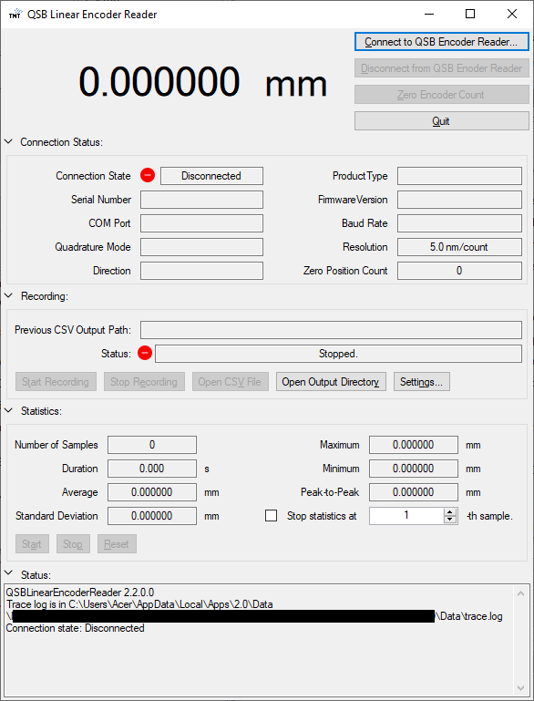

# QSB Linear Encoder Reader

This is a simple Windows application that reads an encoder count through [US Digital QSB-D](https://www.usdigital.com/products/accessories/interfaces/usb/qsb/) and shows it in GUI.

 

## Insallation

If you have an old version installed in your system, remove it first. You can use [a standard Windows procedure](https://support.microsoft.com/en-us/windows/uninstall-or-remove-apps-and-programs-in-windows-4b55f974-2cc6-2d2b-d092-5905080eaf98) to remove QSB Linear Encoder Reader application. The quickest way is to find `TMT International Observatory` - `QSB Linear Encoder Reader` in the Windows menu, right click it and select `Uninstall`.

After your confirm that your system does not have an old version, go to our [Releases](https://github.com/tmtsoftware/m1cs-qsb-linear-encoder-reader/releases) page and download the zip file of the latest version.

Then, extract the zip file, run `setup.exe` in it and follow the instructions to complete the installation. 
You may be asked about the security a couple of times, but please ignore them and proceed.

When the installation process is complete, the application automatically launches.
If not, or if you want to launch it again, select `TMT International Observatory` - `QSB Linear Encoder Reader` in the Windows menu.

## Usage

### Prerequisite

Before launching this application, connect your [QSB-D](https://www.usdigital.com/products/accessories/interfaces/usb/qsb/) to an USB port of your computer.
Then, check the port name of the QSB-D with [US Digital Device Explorer](https://www.usdigital.com/support/resources/downloads/software/qsb-software/).
Typically, it is "COMx" where "x" is an integer number (e.g. COM4).

### Application usage

Once the main application window is shown, click `Connect to QSB Encoder Reader`.

In the "Connect to QSB Encoder Reader" dialog, select an appropriate port name in `COM Port:`, set other configuration items accordingly, and press the `Connect` button.

If it is connected to your QSB-D successfully, it starts to continuously read the current position from the encoder and display it in the main window as shown below:

Press `Zero Encoder Count` button to set the current position as zero.

You can stop recording by pressing `Stop recording` button.

## Recording to a CSV file

If you want to store the encoder readings in a CSV file, click `Set CSV Output Path...` first.
It will ask you which CSV file to save.

Then, click `Start Recording` button to start recording the encoder readings in the specified CSV file.
The CSV file has three fields "Timestamp [ms]", "Raw Count" and "Position [mm]".

This application records the encoder position at the QSB-D's maximum rate (512 Hz).
One line in the CSV file is typically 30 - 50 bytes meaning that the CSV file grows at a rate of about 15 - 25 kB/s, or 0.9 - 1.5 MB per minute.
If you leave it running for more than one day, it would use up around 100 GB of your storage.
So, please make sure that click `Stop Recording` button if you no longer need to record the encoder reading in the CSV file.

Note that the timestamp is based on the 32-bit timestamp register in the QSB-D, which is incremented at 512 Hz.
If you keep running this application more than 94.5 days, the timestamp register may be reset to 0.
The timestamp register is most probably based on a free running counter in the QSB-D, so, when you want to correlate the recorded data in the CSV file with something else, please keep in mind that it can be slightly less or more than 512 Hz.

## License

TMT International Observatory holds the copyright of software, images and documents in this repository except the files below:

 * [docs/qsb-applications-examples.pdf](docs/qsb-applications-examples.pdf)
 * [docs/qsb-commands-list.pdf](docs/qsb-commands-list.pdf)

## Developer information

This chapter includes information for software developers who want to modify the code and release new versions.

### Development environment

The programming language of this software is C#. It is hightly recommended to use
Visual Studio 2022 (or newer) for software development. Instructions below assume
that you have Visual Studio installed in your computer.

### Open the latest source code with Visual Studio

If you already have Visual Studio installed in your computer, you can check out and open
the latest source code from this GitHub page. Before doing so, make sure that you are logged
in GitHub with your account. Then, click "Code" in the top right corner of this page and
select "Open with Visual Studio". Then, Visual Studio will automatically launch, check out
this git repository and open the latest source code in it.

### Release procedure

When you release a new version, follow the steps below:

#### 1. Change assembly version number

Double-click and open [AssemblyInfo.cs](QSBLinearEncoderReader/Properties/AssemblyInfo.cs) under `Properties` in the Solution Exprlorer.
Change the version number in `AssemblyVersion` and `AssemblyFileVersion` at the bottom.

### 2. Generate installer

Double-click and open Properties in the Solution Explorer, and select `Publish` in the left panel of the Properties pane.
Then, change the publish version to match what you set in [AssemblyInfo.cs](QSBLinearEncoderReader/Properties/AssemblyInfo.cs).
After that, press `Publish Now` button to generate an installer.

### 3. Zip the installer

The installer is generated under `publish` folder in the project folder ([QSBlinearEncoderReader/](QSBLinearEncoderReader/)).
Copy the entire `publish` directory to somewhere else. From here on, we assume that it is copied to `C:\publish`.

You should be able to see directories of old versions in `C:\publish\Application Files` like `QSBLinearEncoderReader_1_1_0_0`. Remove all directories of old versions and leave the latest version alone.
For example, if you are going to release version w.x.y.z, remove all directories except `C:\publish\Application Files\QSBLinearEncoderReader_w_x_y_z`.
Then, zip all files in `C:\publish` and change the zip file name to `QSBLinearEncoderReader_w.x.y.z.zip` where `w.x.y.z` is the version number.

### 4. Commit and push code to GitHub

At this point, commit all your local changes in your local git repository. Please make sure that your commit includes all changes and new files under the `publish` directory.
Typically, `publish\QSBLinearEncoderReader.application` is updated and a new directory `publish\Application Files\QSBLinearEncoderReader_w_x_y_z` is added.
The commit message should indicate that it is the new release version like "Version w.x.y.z".
Then, push your local changes to the `master` branch on https://github.com/tmtsoftware/m1cs-qsb-linear-encoder-reader.git.
It is recommended to confirm that your last commit appears in https://github.com/tmtsoftware/m1cs-qsb-linear-encoder-reader.git before going to the next step.

### 5. Draft a new release

Go to [Releases](https://github.com/tmtsoftware/m1cs-qsb-linear-encoder-reader/releases) page of this repository, and click `Draft a new release`.

### 6. Create a release tag on Git

In the new release page, click `Choose a tag` and enter a new git tag name for this release.
The tag name must be `vw.x.y.z` where `w.x.y.z` is the version number. Don't forget `v` at the beginning.

### 7. Enter the release information

Enter the release title and the release description. The title should be "Version w.x.y.z" where `w.x.y.z` is the actual version number.
The release description should include the summary of changes from the previous version.

Then, drag and drop the zip file you created to the bottom of the page and then press `Publish release` button.

### 8. Done!

Now your new released version must appear in https://github.com/tmtsoftware/m1cs-qsb-linear-encoder-reader.git.

Since version 1.4.1.0, everytime the application launches, it investigates 

https://raw.githubusercontent.com/tmtsoftware/m1cs-qsb-linear-encoder-reader/master/QSBLinearEncoderReader/publish/QSBLinearEncoderReader.application

and see if there is a new version. If so, the user is suggested to upgrade to a new version and new versions are downloaded and installed automatically.

## Application examples and comamnd list of QSB-D

Application examples and command list can be obtained at 
https://www.usdigital.com/products/accessories/interfaces/usb/qsb/

The copy of those files can be found in this repository for our records:
 * [docs/qsb-applications-examples.pdf](docs/qsb-applications-examples.pdf)
 * [docs/qsb-commands-list.pdf](docs/qsb-commands-list.pdf)

## Issues

File any bugs, enhancement proposals, feature requests on [Issues](https://github.com/tmtsoftware/m1cs-qsb-linear-encoder-reader/issues).
